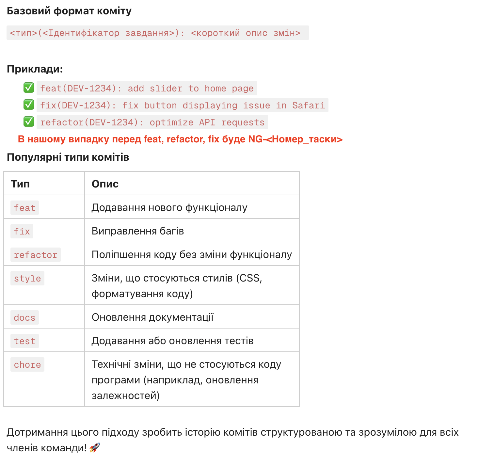
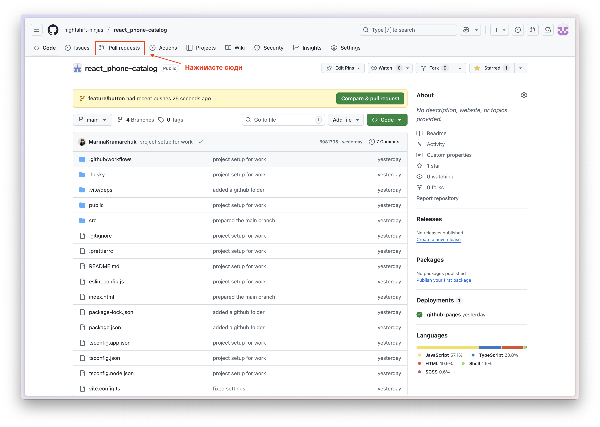
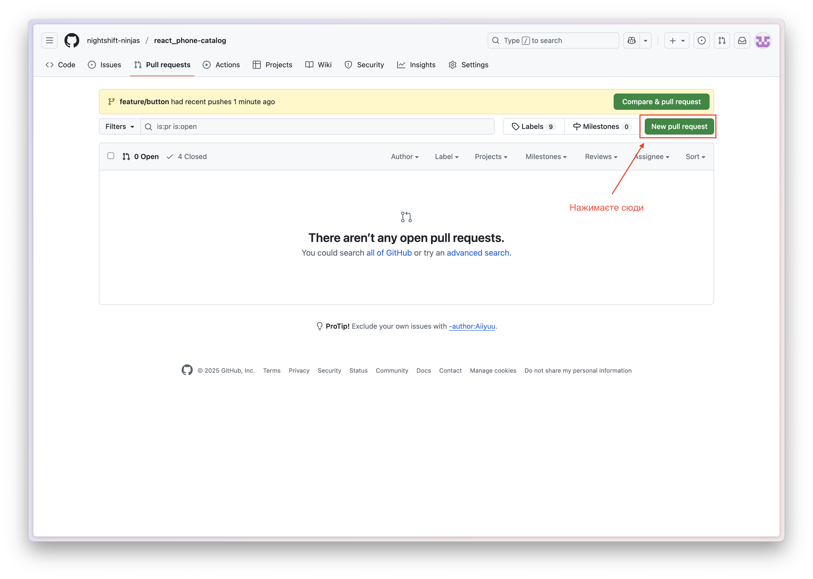
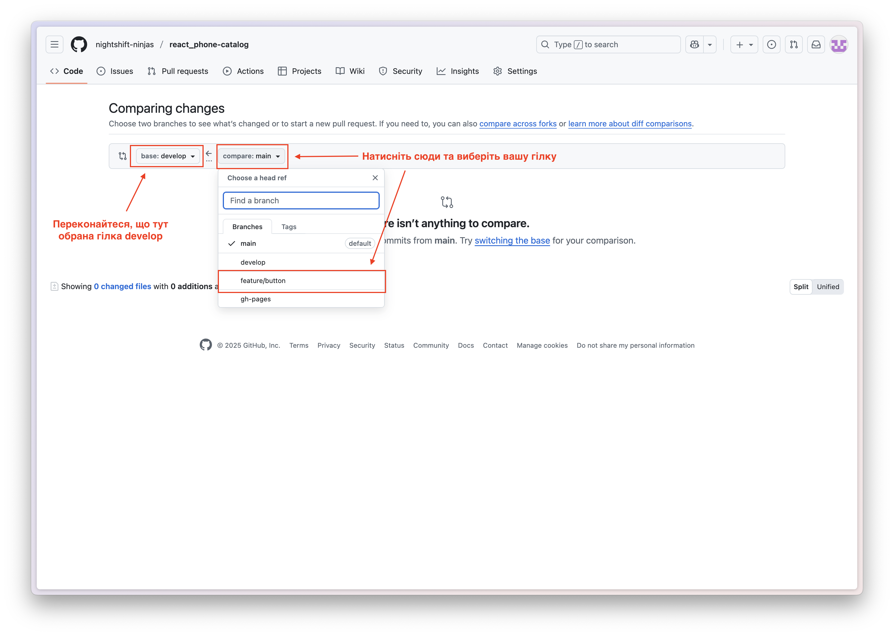
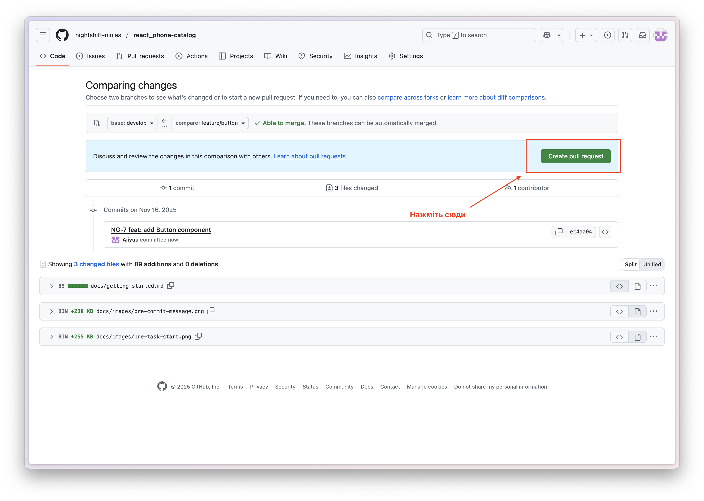
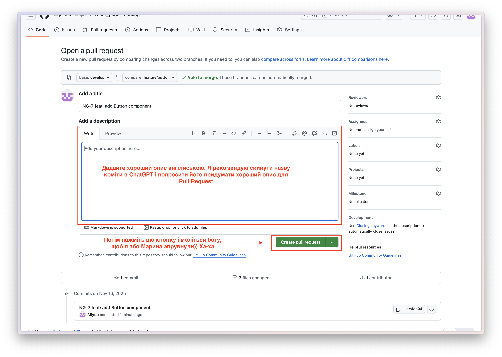
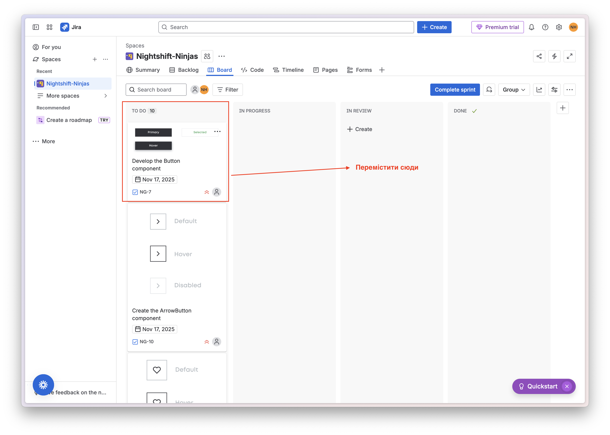

# Робочий процес 🌿

Привіт! 👋 Хочу описати, як у нашій команді буде відбуватися робочий процес.

Кожного ранку о **10:00** 🕙 ми збираємося в [Meet](https://meet.google.com/esp-hvub-skj) 💻, щоб обговорити план на день та розподілити таски між командою. Після цього приступаємо до роботи над задачами. Відкриваємо [Jira](https://nightshift-ninjas.atlassian.net/jira/software/projects/NG/boards/1) 🧩, знаходимо свою таску та **уважно читаємо її опис**. Після цього можна починати виконання задачі.

**Не забудьте перетягнути таску, над якою працюєте, у секцію IN PROGRESS 🔄, щоб я бачив, хто над чим працює.** Також рекомендую в першу чергу брати таски з найвищим пріоритетом 🚀.

## 

### Коли ви визначилися з таскою та готові приступати до написання коду 💻✨, виконайте такі кроки:

1. **Оновіть локальний проєкт, щоб отримати найактуальніші зміни ⬇️:**

   ```bash
   git pull origin develop
   ```

2. **Створіть нову гілку 🌱:** Ця команда автоматично створює гілку та переключає вас на неї:
   ```bash
   git checkout -b <Назва_гілки>
   ```

Вітаю 🎉 тепер ви можете писати код. Удачі вам 🍀

---

## Також вам можуть бути корисні такі команди:

**Щоб переглянути які файли були змінені 🟢:**

```bash
git status
```

**Щоб переключитися між гілками 🔁:**

```bash
git checkout <Назва_гілки>
```

**Щоб переглянути список гілок 📃:**

```bash
git branch
```

**Щоб видалити гілок 📃:**

```bash
git branch -D <Назва_гілки>
```

---

### Коли код готовий і працює 🟢✨:

**Додайте зміни та зробіть коміт 💬:**

```bash
git add .
```

```bash
git commit -m "NG-7: add button component"
```

**Або зробіть це однією командою ⚡:**

```bash
git commit -a -m "NG-7 feat: add button component"
```

**🚨 Якщо потрібно змінити опис коміта ✏️:**

```bash
git commit --amend -m "змінена назва"
```

**Тепер коли ви все закомітили 🥳 Можите запушити на github 🐈‍⬛**

```bash
git push origin <Назви_гілки>
```

### УВАГА ❗

> 🔹 Назва коміта повинна починатися з `NG-<номер таски в Jira>`.
> **NG** — це скорочення від **Nice Gadgets**, що відповідає назві сайту у **Figma.**

> 🔹 Також ви повинні використовувати коміт-меседжі, що відповідають конвенціям.
> Ознайомитися з ними можна [тут 👉](https://doc.clickup.com/24383048/p/h/q83j8-1330655/fe2b3402be1f9d1/q83j8-1486195)



---

### Як зробити PR (Pull Request) у **GitHub** 💻✨

Після того, як ви запушили гілку на GitHub, виконайте наступні кроки:







### ⚠️ УВАГА

Після того як ви запушили завдання, ви **повинні перемістити вашу таску** в колонку **IN REVIEW** та чекати, поки Проджект-менеджер або Тімлід зробить рев’ю вашого PR і апрувне його. А якщо не апрувне — перероблюйте.
А шо ви хотіли, то вам не ментори в Mate Academy - тут що-небудь апрувати не будуть 😎

До речі, Проджект-менеджер усе одно повинен робити рев’ю Тімліда, і навпаки - Тімлід повинен рев’ювати Проджект-менеджера 🔄



### 💡 Рекомендація

Я рекомендую (але не змушую 😉) робити рев’ю іншим членам команди, включаючи Проджект-менеджера та Тімліда.
Це дозволить вам краще розібратися в чужому коміті, робити корисні нотатки та розвивати навички роботи з кодом.

Ну і звичайно, якщо ви знайдете помилку, чи якісь рекомендації - напишіть про це. Або навіть ріджекніть Pull Request.
Але потім не дивуйтеся, чому вам Ніно пише про відрахування 🤣

### ✔️ Коли таска буде перевірена

Як тільки ваше завдання пройде рев’ю та все буде впорядку, таску перемістять у колонку **DONE**, а вашу гілку Проджект-менеджер або Тімлід **зроблять merge у гілку develop** 🚀

### 🚨 Не забудьте після АПРУВУ вашого коміту зробити наступне:

1. **Перейти в гілку develop:**

   ```bash
   git checkout develop
   ```

2. **Отримати актуальні зміни:**

   ```bash
   git pull origin develop
   ```

3. **Видалити вашу гілку з GitHub:**

   ```bash
   git push origin --delete <назва_гілки>
   ```

4. **Видалити її локально:**

   ```bash
   git branch -D <назва_гілки>
   ```

Після цього можете сміливо переходити до виконання наступної таски 💪🔥

---

## Що робити, коли під час PR виник конфлікт ⚔️🤯

Коротко: **конфлікт** - це коли Git не може автоматично об’єднати ваші зміни з тим, що вже є в гілці.
Іншими словами - двоє людей одночасно полізли в один і той самий файл і Git такий: _"Ей, вирішіть самі, я не знаю, яку версію брати"_ 😅

Не хвилюйтесь, це нормальна ситуація, яка трапляється навіть у синьйорів 👨‍💻✨
Просто відкрийте файл, знайдіть місце з конфліктом, акуратно виберіть правильний варіант або об’єднайте їх - і все буде 🆗😉

> 🎥 Відео від Mate Academy, як впоратися з конфліктами [дуже коротко і зрозуміло ⭐](https://mate.academy/en/study/fullstack/git-and-terminal/working-with-branches?learnItemsFilter=All&section=video&testTaskSlug=qa_working_with_branches_quiz&theoryId=7654&videoId=8643)

> 📚 Документація від Mate Academy [для тих, хто хоче детальніше 🤓](https://mate.academy/en/study/fullstack/git-and-terminal/working-with-branches?learnItemsFilter=All&section=theory&testTaskSlug=qa_working_with_branches_quiz&theoryId=7654&videoId=8643)

### ‼️ Якщо прям дуже тяжко — пишіть проджект-менеджеру або тімліду 💬😊 І памʼятайте ви найкращі ❤️‍🔥❤️‍🔥❤️‍🔥
